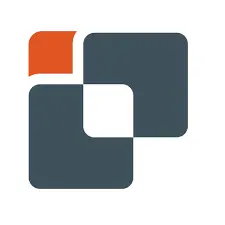

## Innux Technologies

- FullStack Developer | Fev '20 - Present day
- 
- Tags: Technology
- Badges:
  - C# [purple]
  - .NET [blue]
  - JAVASCRIPT [yellow]
  - HTML & CSS [orange]
  - Bootstrap [red]
  - SQL [gray]
- List Bullets:
  - Collaborated in the development of various commercial backend services for ticketing, access control and clocking.
  - Collaborated on the development of a platform for attendance, access management, and HR management. (Currently maintaining and working on new features)
  - Contributed to the analysis and subsequent design of UI interfaces and solutions.
  - Develop several mobile applications using old Xamarin and the new .NET MAUI framework (currrently maintaining).
  - Provided assistance and collaboration in the maintenance of legacy applications.
